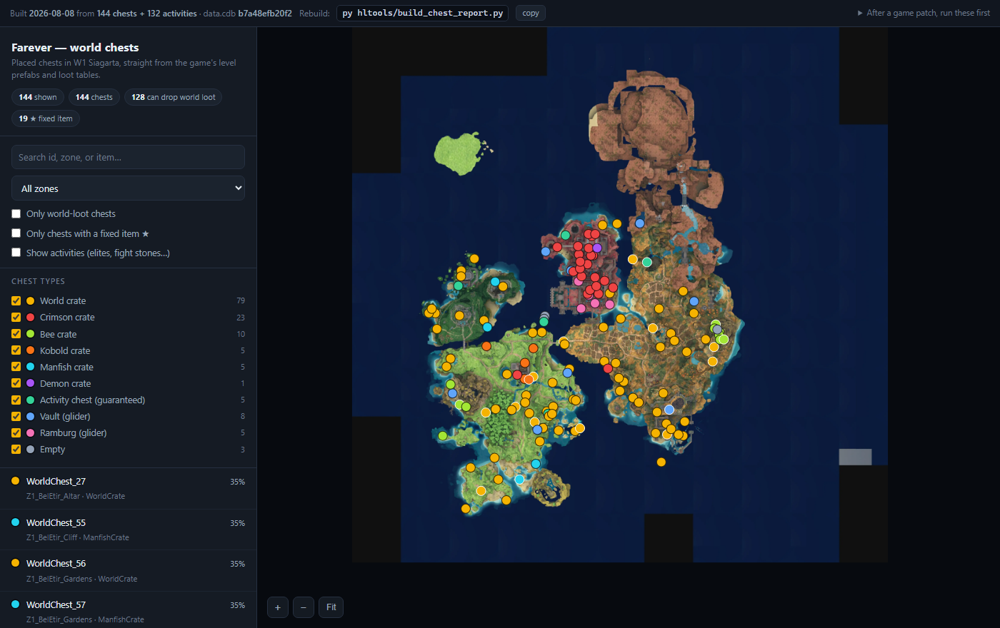

# farever-chest-map

**Every chest in Farever's open world, plotted on the game's own map, with what
each one can actually drop.**

### → [Open the map](https://brudrbear.github.io/farever-chest-map/)

Or grab [`report/chest_map.html`](report/chest_map.html) and open it locally —
it is a single self-contained file. No server, no network, no install.



144 chests across W1 Siagarta, read out of the game's level prefabs and loot
tables rather than crowd-sourced. For each one: the flattened loot table with
probabilities, the world coordinates, the chest level, and whether it can drop
the world weapon pool at all.

- **Filter** by chest type, zone, "can drop world loot", or "has a fixed item".
- **Search** by id, zone, or any item it can pay — typing `Radiance` lights up
  the 128 chests whose table carries the `WorldLoot` token.
- **Click** a chest, on the map or in the list, for its full drop table.
- **Link** to one with `#id=<element id>`.
- **19 chests** carry a hand-placed guaranteed item on top of their table
  (marked ★): a glider, two Mastery runes, and sixteen collection packages.

## Quick start

The built page is committed, so reading it needs nothing at all. To rebuild it
from your own copy of the game:

```bash
py hltools/pak_extract.py extract data.cdb --pak "<Farever>\res.light.pak" --out analysis_out/cdb
py hltools/build_chest_report.py
```

Requires Python 3.11+ and Pillow. Everything else — the map tiles, the
placements, the loot tables — is located automatically next to `hlboot.dat` and
baked into the page at build time. The page never reads the game.

## Where the numbers come from

Three game-derived inputs, no guesswork and no wiki scraping:

| input | source | what it gives |
|---|---|---|
| `analysis_out/prefabs_map/*.prefab` | `res.map.pak` | every placed chest, its loot table, its world position |
| `analysis_out/cdb/data.cdb` | `res.light.pak` | the loot tables, flattened through their nesting |
| `assets/maps/w1_siagarta.*` | `res.map.pak` minimap tiles | the map image and the world→pixel transform |

The world prefabs are **HBSON with an interned string table**, which is the
trap worth knowing about: a byte scan finds only each string's *first*
occurrence, and every later use is a 4-byte back-reference it cannot see. That
undercounts placements silently. `hltools/hbson.py` parses the tree properly and
is validated two ways — exact end-of-buffer consume on all 824 world prefabs,
*and* plausible object keys, because consume alone still passes when the string
indexes are off by one. Parsed counts:

```
144 chests   128 with a WorldLoot roll   19 with a hand-placed item
132 activities (124 of them pay a guaranteed WorldLootWithAffinity)

WorldCrate 79   CrimsonCrate 23   BeeCrate 10   KoboldCrate 5
ManfishCrate 5  DemonCrate 1      Vault_* 8     Ramburg_* 5   Empty 3
        + 5 chests wired to an *Activity* table, i.e. token at proba 1
```

The transform is not eyeballed: the game names each minimap tile
`<tx>_<ty>_1024.png` covering world `[tx*576, (tx+1)*576)` per axis, so
`image_px = (world - tile_origin) * 1024/576` with +y drawn down. It was
cross-checked by projecting known obelisk coordinates onto the stitched image.

**One thing the page cannot tell you.** The `WorldLoot` token is expanded
*server-side* into one of the six `faction: World` weapons (Glory, Dominion,
Twin Fangs of Ratsar, Judgement, **Radiance**, Credence). The pool is readable;
the weighting inside it is not, because that code never runs on the client. The
page says so wherever it shows the token, and does not pretend `0.35 / 6` is
measured.

---

## The research this came out of

The rest of this README is the original spike: **how Farever decides a chest has
been opened**, and what that means for measuring drop rates. It reuses the
machinery FareverMeter paid for — the HashLink bytecode parser, the
`functions_ptrs` resolver, the name-resolved offset emitter, the staleness gate,
and the game-thread rule.

Everything here is **read-only**. Every Interceptor logs; nothing is called, no
argument is replaced, no game memory is written. There is no automation, no
packet is sent, and nothing is written back into the game.

### Status

Static analysis done, **and confirmed live** against the running game on
2026-08-01 (~5 min, 8 chests in the layer, all of them already opened on that
character). Results in "What the probe measured" below. The static section that
follows it is what the bytecode implied; the measured section is what actually
happened.

---

## What the probe measured (2026-08-01, live)

### The detection mechanism, caught in the act

Every chest streams in with `currentVisualState = null` and is then handed to
`st.WorldContext.getElementState`. The answer to that lookup is what sets the
visual:

```
Z1_World_Greenlands_WorldChest_41    Closed|null|1  ->  Closed|Opened|1
Recipe_Chest_Root_11                 Closed|null|1  ->  Closed|Opened|1
Z1_World_Greenlands_Camp_2_Chest_1   Locked|null|1  ->  Locked|Opened|1
FightStone                           Closed|null|1  ->  Closed|Closed|1   <- not opened
                                    (stateId|currentVisualState|enabled)
```

That `FightStone` row is the control: same code path, same streaming, and it
resolves to `Closed` because the ledger has no entry for it. **The chest does
not remember anything — the WorldContext does, and the chest asks.**

`stateId` never moved on any of the eight, confirming the meter's earlier
measurement. It is the CDB-authored *design* state (`Closed`, or `Locked` for
a chest that needs a key), not runtime state. `WorldContext.getElementState`
was called 9,218 times in five minutes, 6,303 of them carrying a single nearby
chest — this lookup is polled continuously, not cached onto the entity.

### An opened chest never even asks the server

Standing directly in front of an already-opened chest, **no interact prompt
appears at all**, and the RPC path is never entered:

```
requests that reached ent.Interactible.requestInteraction, by target:
    InstanceOrb(POI_Rift_Entrance_3)   x1        <- a rift portal, worked fine
    Chest(...)                          x0
```

The rift portal is the positive control that proves the hooks work: it went
the whole way through `tryRequestInteraction -> requestInteraction ->
checkRequestInteraction -> apiRpcRequestInteraction -> checkUse`. Chests
reached none of it.

What runs instead is the client-side gate, polled every frame:

```
PlayerController.getClosestInteractible   x11,711
Interactible.getInteractCooldown          x52,104
Interactible.canInteract                   x9,321
Interactible.canActivate                   x8,547
```

For an opened chest those predicates return false, so the prompt is suppressed
and no request is ever sent. The refusal is **client-side and silent**, ahead
of the server ever being asked.

### The client does not roll loot — measured, not argued

These hooks fired **zero times** across the entire session, including during
the real rift-portal interaction:

```
ent.Hero.generateLootItem          ent.Hero.generateWorldLootItem
ent.Hero.resolveLootItem           ent.Hero.makeLootItem
ent.Element.dropLootTable          st.Loadout.addItem
st.player.Progress.incrementItemLoot
```

They exist in the binary because client and server share one Haxe codebase.
They do not execute on the client. This is the same result the meter reached
for item pickups, now confirmed on the chest path specifically.

---

## What the bytecode says (measured from `hlboot.dat`, 47,342 functions)

### 1. The Chest class is a replication target, not a game object

`ent.interactible.Chest extends ent.Element` and adds **zero fields of its
own**. Its full method list is:

| method | what it is |
|---|---|
| `onPlayerActivate` | the only gameplay method |
| `getCLID`, `networkFlush`, `networkSync`, `unserialize`, `markReferences`, `getVisibilityMask` | hxbit networking boilerplate |

There is no `open()`, no `loot()`, no `roll()`. Compare `ent.interactible.Gatherable`
in the same package, which *does* carry `doActionServer`, `consume`, `rollAffix`,
`respawn` and `getRespawnTime` — those are server-side methods compiled into the
same binary, because client and server share one Haxe codebase.

### 2. The interaction is an RPC, and the client is the requester

`ent.Interactible` carries the full hxbit request/impl pattern:

```
requestInteraction / requestActivate        <- client sends
  apiRpcRequestInteraction                  <- dispatch
    apiRpcRequestInteraction__impl          <- body, runs on the authority
```

plus `canRequestActivate`, `checkRequestActivate`, `canPlayerActivate` and
`getInteractCooldown` on the client side. The client's job is to *ask*.

### 3. The "already opened" record is not on the chest

`ent.Element` has `stateId` and `currentVisualState`. FareverMeter already
measured what these do when you loot a chest:

```
before   stateId Closed   currentVisualState Closed
after    stateId Closed   currentVisualState Opened
```

`stateId` does not move. `currentVisualState` is cosmetic — it is what the
model plays, and filtering the minimap on it was correct only because a spent
chest happens to look different.

The real ledger is **`st.WorldContext.elements`**, a `haxe.ds.StringMap`, with
`getElementState` / `setElementState` / `_setElementState__impl` /
`resetElementState`. And it is scoped:

```
ent.ElementScope = World | Group | Player
st.Player.playerContext : st.WorldContext     <- the per-player one
```

So "has this chest been opened" is answered by a keyed lookup in a world
context whose scope decides whether it is per-player, per-group, or global.
The probe hooks those three functions and prints the key and value rather than
guessing at the StringMap layout.

### 4. Bad-luck protection exists, but is **opt-in per table** — and almost nothing opts in

> **CORRECTION.** An earlier revision of this file claimed drop rates in this
> game are "deliberately not independent" as a blanket statement. That was
> overstated. The BLP machinery is real, but reading the CDB column definitions
> shows it is a per-table flag that hardly any table sets.

`st.player.HeroData` carries `worldLootLog` (replicated) and
`lootLogContainsItem`, and the string pool has `BLP_LootLog`, `LootLog_Size`,
`LootLog_LevelDifference`. But the `lootTable.flags` column is declared as:

```
"typeStr": "10:Weights,WithAffinity,BLP_LootLog,BLP_AlreadyOwned"
    bit 1 = Weights          bit 4 = BLP_LootLog
    bit 2 = WithAffinity     bit 8 = BLP_AlreadyOwned
```

Across all 139 tables: **no table sets `BLP_LootLog` (4) at all**, and exactly
one — `Rift_GearWithAffinity` (flags=10) — sets `BLP_AlreadyOwned`. Everything
else is flags 1, 2, or none.

So for the world/faction crates, **rolls are independent**. BLP is a rift-gear
mechanism, not a global one.

### 5. `Weights` is the flag that changes how a table is read

Bit 1 (`Weights`) means *pick one row, weighted by `proba`*. Without it, **each
row rolls independently on its own `proba`**. This is what makes the container
tables composable:

```
WorldCrate    flags=none  -> every row rolls: CurrencyCrate(1), HumanoidWeights(1) x2,
                             WorldLoot(0.35), GatherSamplesWeight(0.25),
                             WorldRecipeWithJob(0.2), Mastery(0.05),
                             SkillPointBook_Red(0.08), TPDeathStone(0.1)
HumanoidWeights, Ores, Gems, Clothes, *Weights, boss tables …  flags=1 -> pick one
```

Every faction crate includes `WorldCrate` at `proba 1`, and none of the crates
set `Weights` — so `WorldLoot` fires at exactly **0.35 in all of them**.
`CrimsonCrate` being a bare passthrough means it yields *less* than its
siblings, not that its `WorldLoot` roll is likelier.

---

## On re-opening a chest repeatedly

The original ask was to make a chest re-openable back-to-back to sample drops.
Based on the above, that is not something this project will do, for two
separate reasons.

**It cannot work from the client — this is now measured, not inferred.** There
are two independent walls, and the probe saw both:

1. The opened-ness answer comes from `WorldContext.getElementState`, which the
   client *queries*. Forcing the local answer would flip the chest's model back
   to `Closed` and re-show the prompt — a lie told to your own renderer. The
   request would then go to a server that still has the real entry.
2. The client never rolls the loot. `generateLootItem`, `resolveLootItem`,
   `makeLootItem` and `dropLootTable` fired zero times in a session that
   included a real, successful interaction. There is no local roll to re-run,
   so there is nothing client-side that could produce a second sample even in
   principle.

Re-firing a local interaction re-asks a question the server has already
answered, using a roll the client does not own.

**And if some path did work, it would be a loot dupe on a live server**, not a
test harness — real items minted into a shared economy that other players play
in. The measurement goal does not change what the mechanism is.

The probe hooks those loot functions precisely because **their absence from a
real trace is the evidence**, and that is how the question got settled — by
measurement rather than by argument.

### What actually answers the drop-rate question

A **loot logger**: record every chest open and everything that arrived, across
normal play, and accumulate real empirical statistics. It is honest, it needs
no server-side lie, and given the bad-luck-protection finding it is also the
*more accurate* instrument — it samples the distribution the game actually
implements, including the BLP behaviour, instead of hammering one input that
the pity system is specifically designed to respond to.

Better still, because `worldLootLog` is replicated to the client, a logger can
read the BLP ledger alongside each drop and characterise how the log changes
the odds. That is a genuinely more interesting result than a flat drop rate,
and nothing about it requires touching the server.

**Sample volume is a routing problem, not a protocol problem.** Chest state
appears to be per-character — Brudr has every chest opened on the current
character while the world still streams them in as entities — which matches
`ElementScope.Player` and `st.Player.playerContext`, though the scope field
itself has not been read directly yet. A fresh character therefore sees a full
world of unopened chests. `ent.interactible.Refresher`, `Gatherable.respawn`
and `getRespawnTime` mean some interactibles legitimately come back as well.

So the practical instrument is: a logger, a route, and repetition across
characters or respawn cycles — with `worldLootLog` read alongside each drop so
the BLP effect can be separated from the base rate instead of silently
contaminating it.

---

## Layout

```
hltools/
  pak_extract.py            list/extract entries from the Heaps .pak archives
  gamepath.py               locate the Farever install, no hardcoded paths
  hbson.py                  reader for the level-prefab binary format
  build_map_assets.py       stitch the minimap tiles + emit the transform
  build_chest_report.py     the report generator
  chest_report.template.html  its page (data and map are injected at build)

  hlbc_parser.py            HashLink bytecode reader        (from FareverMeter)
  datafresh.py              refuse to run against stale data(from FareverMeter)
  chest_survey.py           dump every chest/loot class, field and method
  find_openrecord.py        find where "already opened" is stored
  find_lootlog.py           find the BLP loot log + element state machinery
  build_chest_targets.py    emit resolver_data.json + chest_offsets.json
frida/
  chest_probe.js            the read-only probe (46 hooks, ordered trace)
  run_chest.py              host; logs to logs/chest-<stamp>.log
assets/maps/                the stitched map + transform, committed
report/                     the built page, committed
analysis_out/               generated, not committed; stale after a game patch
logs/                       probe sessions, not committed
```

The first group builds the map; the second is the probe that produced the
research below. They share `analysis_out/`, nothing else.

Note that the placement counts at the top of this README are **higher** than the
`lootTable` reference counts quoted in "Is Radiance Crimson-exclusive?" below.
Those earlier figures came from a byte scan, before `hbson.py` existed, and they
missed every interned back-reference. The parsed numbers are the correct ones.

## Running the probe

Every findex and offset in `analysis_out/` is a snapshot that **goes stale at
each game patch**. Regenerate first, always:

```bash
py hltools/build_chest_targets.py
```

Then, with the game running:

```bash
py frida/run_chest.py 900
```

Wait for the `PROBE ARMED` line before touching anything in game — the hooks
are live before that, but the local hero is not latched and the trace will not
be attributed.

Note that on a character with everything already looted there is nothing to
press: an opened chest shows **no interact prompt at all**. That is not the
probe failing, it is the result (see the measured section above). To capture a
successful open, run this on a character with unopened chests.

`run_chest.py` aborts if `analysis_out/` was built from a different
`hlboot.dat`. That gate exists because the failure it prevents is silent: stale
native anchors resolve the `functions_ptrs` base to a self-consistently wrong
address, every findex then points at an unrelated function, and the probe
reports nothing while appearing to work.

## The thread rule

Any HL call from a frida timer thread dies with *"Can't lock GC in unregistered
thread"*, non-deterministically, and it has crashed the live game before. The
only HL call in this probe is the `getMyHero` lookup, and it runs inside the
`client.BaseCamera.postUpdate` hook — on the game thread. The 400 ms sweep does
plain pointer and string reads and nothing else.

---

## The Radiance question (2026-08-01)

"Radiance" is the item `Staff_Craft` — a Staff, `faction: World`, base level 4
(item level is rolled at drop time, so a level-25 one is normal). Two other
things in the game are also called Radiance (`Scepter_Start_Skill2` and
`Priest_Talent_Radiance`, both skills); those are not it.

**The chests people point at are `CrimsonCrate` chests.** Measured: opening
`Z1_World_Greenlands_WorldChest_12` fired
`WorldContext._setElementState__impl("Z1_World_Greenlands_WorldChest_12", …,
"Opened")` exactly once. Its prefab
(`Level/World/W1_Siagarta.dat/gameplayData/L0_+6_-7.prefab`) declares:

```
lootTable  CrimsonCrate      faction  Crimson
zoneBaked  Z3_CrimsonIsland_Cathedral
```

The `Greenlands` in the element id is a stale level-design name — these are
physically in Crimson Island Cathedral, which is why the zone never matched.

**Radiance is reachable, and the path is intact.** `CrimsonCrate` contains no
explicit weapon rows at all. The only weapon path is the `WorldLoot` token at
`proba 0.35` inside `WorldCrate`, which the server expands via
`$HItem.isWorldLoot` / `getFactionLootTable` / `generateLootTable` and
`ent.Hero.generateWorldLootItem`. The `faction: World` pool is exactly six
items, and Radiance is one of them:

```
Sword_Craft  Shield_Craft  Daggers_DuplicatePoison
GA_Craft     Bow_Craft     Staff_Craft (Radiance)
```

If that generator draws uniformly, Radiance is roughly `0.35 / 6 ≈ 5.8%` per
chest — but **that is an assumption, not a measurement**: the generator body is
server-side and this parser deliberately does not read opcodes, so the weighting
(and any level/aptitude filter, and the separate `WorldLootWithAffinity` token)
is unverified.

### A real anomaly, though — CrimsonCrate is the only bare faction crate

Every other faction crate layers faction content on top of `WorldCrate`.
`CrimsonCrate` does not:

```
BeeCrate      -> NatureWeights + WorldCrate
KoboldCrate   -> Ores + EarthWeights + WorldCrate
ManfishCrate  -> WaterWeights + WorldCrate
DemonCrate    -> ChaosWeights + WorldCrate + Demon_Weight
CrimsonCrate  -> WorldCrate                      <- nothing else
```

`CrimsonCrate` also never references the `Crimson` faction table, so everything
that table would contribute — `Ramgold`, `StaleBread`, `Pumpkin`, `Cheese_Z2`,
its own extra `WorldLoot` rolls, and `Mount_Hound_01` at `0.001` — cannot come
out of these chests at all. That is a concrete content bug worth reporting, but
it is **not** the Radiance bug: the `WorldCrate → WorldLoot` path that produces
Radiance is present and unaffected.

### On re-opening to test this

Not built, and not buildable client-side. Measured twice: the client never
rolls loot (every loot function stayed at zero across two sessions including a
successful open), and the opened-record RPC *arrives* at the client from the
authority. There is no local roll to re-run. See the section above.

### Is Radiance Crimson-exclusive? No — three reasons

1. **Every faction crate has the same `WorldLoot` roll.** They all include
   `WorldCrate` at `proba 1`, and none set `Weights`, so the 0.35 is identical
   across `CrimsonCrate`, `BeeCrate`, `KoboldCrate`, `ManfishCrate` and
   `DemonCrate`. CrimsonCrate's missing faction table removes Crimson content;
   it does not raise the weapon chance.

2. **Plain `WorldCrate` chests are the most common kind.** Counting `lootTable`
   references in the world prefabs that contain chests:

   ```
   WorldCrate 69   WorldActivity 27   CrimsonCrate 15   CrimsonActivity 9
   BeeCrate    8   KoboldActivity 5   ManfishCrate  4   BeeActivity     4
   ManfishActivity 3   DemonActivity 2   KoboldCrate 2
   Vault_Z1_1 / Z2_1 / Z2_3 / Z3_1 / Z3_2 …   Ramburg_1..5
   ```

   A plain `WorldCrate` chest has exactly the same Radiance odds and there are
   over four times as many of them.

3. **The Ramburg chests cannot drop it at all.** `Ramburg_1` … `Ramburg_5` are
   deterministic glider chests — `Gold` and one specific Pigeon glider, both at
   `proba 1`, no `WorldLoot`, no weapons:

   ```
   Ramburg_1  Gold + Glider_Pigeon_Beige   "Swift"
   Ramburg_2  Gold + Glider_Pigeon_Blue    "Rigtheous"
   Ramburg_3  Gold + Glider_Pigeon_Grey    "Valiant"
   Ramburg_4  Gold + Glider_Pigeon_Grey02  "Loyal"
   Ramburg_5  Gold + Glider_Pigeon_Purple  "Gourmet"
   ```

   So the "chests in Ramburg that drop level-25 Radiance" report does not match
   the data at all — those five are the collectible glider chests.

---

## About the game data

Farever is © its developers. The map tiles, item names and loot values in
`assets/`, `report/` and this README are extracted from the game's own files
and are theirs, not mine — they are here so the map is readable without owning
a copy, and they will be removed on request.

The extraction is read-only and offline: it reads `.pak` archives and
`hlboot.dat` on disk. The probe under `frida/` attaches to a running client and
**logs only** — no call is made, no argument replaced, no memory written, no
packet sent, nothing automated. It exists to answer questions about how the game
works, and the answer it produced is documented above: the client cannot roll
loot, so re-opening a chest to farm drop rates is not possible client-side, and
would be a dupe on a live server if it were.
